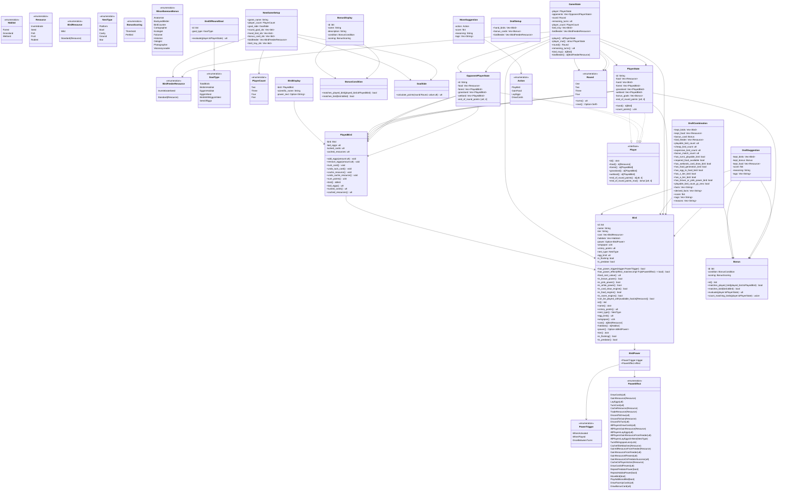

```mermaid
classDiagram
    class BirdPower {
        +PowerTrigger trigger
        +PowerEffect effect
    }
    class PowerTrigger {
        <<enumeration>>
        WhenActivated
        WhenPlayed
        OnceBetweenTurns
    }
    class Habitat {
        <<enumeration>>
        Forest
        Grassland
        Wetland
    }
    class Resource {
        <<enumeration>>
        Invertebrate
        Seed
        Fish
        Fruit
        Rodent
    }
    class PowerEffect {
        <<enumeration>>
        DrawCards(u8)
        GainResource(Resource)
        LayEggs(u8)
        TuckCard(u8)
        CacheResource(Resource)
        TradeResource(Resource)
        DiscardToDraw(u8)
        DiscardToGain(Resource)
        DiscardToTuck(u8)
        AllPlayersDrawCards(u8)
        AllPlayersGainResource(Resource)
        AllPlayersLayEggs(u8)
        AllPlayersGainResourceFromFeeder(u8)
        AllPlayersLayEggsOnNest(NestType)
        TuckIfWingspanLess(u16)
        CacheIfDieMatches(Resource)
        GainAllResourceFromFeeder(Resource)
        GainResourceFromFeeder(u8)
        GainResourceIfFewest(u8)
        GainResourceOnPredatorSuccess(u8)
        CacheOnPlayerAction(Resource)
        DrawCardsIfFewest(u8)
        RepeatPredatorPower(bool)
        RepeatHabitatPower(bool)
        MoveBird(bool)
        PlayAdditionalBird(bool)
        DrawFaceUpCards(u8)
        DrawBonusCard(u8)
    }
    class BirdResource {
        <<enumeration>>
        Standard(Resource)
        Wild
    }
    class BirdFeederResource {
        <<enumeration>>
        Standard(Resource)
        InvertebrateSeed
    }
    class NestType {
        <<enumeration>>
        Platform
        Bowl
        Cavity
        Ground
        Star
    }
    class BonusScoring {
        <<enumeration>>
        Threshold
        PerBird
    }
    class MiscellaneousBonus {
        <<enumeration>>
        Anatomist
        BackyardBirder
        BirdCounter
        Cartographer
        Ecologist
        Falconer
        Historian
        Oologist
        Photographer
        VisionaryLeader
    }
    class GoalType {
        <<enumeration>>
        TotalBirds
        BirdsInHabitat
        EggsInHabitat
        EggsInNest
        BirdsWithEggsInNest
        SetsOfEggs
    }
    class PlayerCount {
        <<enumeration>>
        Two
        Three
        Four
        Five
    }
    class Bird {
        -id: i64
        -name: String
        -tier: String
        -cost: Vec~BirdResource~
        -habitats: Vec~Habitat~
        -power: Option~BirdPower~
        -wingspan: u16
        -victory_points: u8
        -nest_type: NestType
        -egg_limit: u8
        -is_flocking: bool
        -is_predator: bool
        +has_power_trigger(trigger:PowerTrigger) bool
        +has_power_effect(effect_matches:impl Fn(&PowerEffect) -> bool) bool
        +food_cost_value() u8
        +is_brown_power() bool
        +is_pink_power() bool
        +is_white_power() bool
        +is_card_draw_engine() bool
        +is_food_engine() bool
        +is_raven_engine() bool
        +can_be_played_with(available_food:&[Resource]) bool
        +id() i64
        +name() &str
        +victory_points() u8
        +nest_type() NestType
        +egg_limit() u8
        +wingspan() u16
        +cost() &[BirdResource]
        +habitats() &[Habitat]
        +power() Option~&BirdPower~
        +tier() &str
        +is_flocking() bool
        +is_predator() bool
    }
    class PlayedBird {
        -bird: Bird
        -laid_eggs: u8
        -tucked_cards: u8
        -cached_resources: u8
        +add_eggs(amount:u8) void
        +remove_eggs(amount:u8) void
        +tuck_card() void
        +undo_tuck_card() void
        +cache_resource() void
        +undo_cache_resource() void
        +sum_points() u16
        +bird() &Bird
        +laid_eggs() u8
        +tucked_cards() u8
        +cached_resources() u8
    }
    class BirdDisplay {
        -bird: PlayedBird
        -scientific_name: String
        -power_text: Option~String~
    }
    class BonusCondition {
        +matches_played_bird(played_bird:&PlayedBird) bool
        +matches_bird(bird:&Bird) bool
    }
    class Bonus {
        -id: i64
        -condition: BonusCondition
        -scoring: BonusScoring
        +id() i64
        +matches_played_bird(played_bird:&PlayedBird) bool
        +matches_bird(bird:&Bird) bool
        +evaluate(player:&PlayerState) u8
        +count_matching_birds(player:&PlayerState) usize
    }
    class BonusDisplay {
        -id: i64
        -name: String
        -description: String
        -condition: BonusCondition
        -scoring: BonusScoring
    }
    class DraftCombination {
        +kept_birds: Vec~Bird~
        +kept_food: Vec~Resource~
        +bonus_card: Bonus
        +bird_feeder: Vec~Resource~
        +playable_bird_count: u8
        +cheap_bird_count: u8
        +expensive_bird_count: u8
        +bonus_match_count: u8
        +has_turn1_playable_bird: bool
        +required_food_available: bool
        +has_wetlands_card_draw_bird: bool
        +has_food_generation_bird: bool
        +has_egg_to_food_bird: bool
        +has_s_tier_bird: bool
        +has_a_tier_bird: bool
        +has_brown_or_pink_power_bird: bool
        +playable_bird_count_gt_zero: bool
        +facts: Vec~String~
        +derived_facts: Vec~String~
        +score: f64
        +tags: Vec~String~
        +reasons: Vec~String~
    }
    class NewGameSetup {
        +game_name: String
        +player_count: PlayerCount
        +goal_side: GoalSide
        +round_goal_ids: Vec~i64~
        +hand_bird_ids: Vec~i64~
        +bonus_card_ids: Vec~i64~
        +birdfeeder: Vec~BirdFeederResource~
        +bird_tray_ids: Vec~i64~
    }
    class GameState {
        -player: PlayerState
        -opponents: Vec~OpponentPlayerState~
        -round: Round
        -remaining_turns: u8
        -player_count: PlayerCount
        -bird_tray: Vec~Bird~
        -birdfeeder: Vec~BirdFeederResource~
        +player() &PlayerState
        +player_mut() &mut PlayerState
        +round() Round
        +remaining_turns() u8
        +bird_tray() &[Bird]
        +birdfeeder() &[BirdFeederResource]
    }
    class GoalSide {
        +calculate_points(round:Round, value:u8) u8
    }
    class EndOfRoundGoal {
        -id: i64
        -goal_type: GoalType
        +evaluate(player:&PlayerState) u8
    }
    class PlayerState {
        -id: String
        -food: Vec~Resource~
        -hand: Vec~Bird~
        -forest: Vec~PlayedBird~
        -grassland: Vec~PlayedBird~
        -wetland: Vec~PlayedBird~
        -bonus_goals: Vec~Bonus~
        -end_of_round_points: [u8; 4]
        +hand() &[Bird]
        +count_points() u16
    }
    class OpponentPlayerState {
        -id: String
        -food: Vec~Resource~
        -forest: Vec~PlayedBird~
        -grassland: Vec~PlayedBird~
        -wetland: Vec~PlayedBird~
        -end_of_round_points: [u8; 4]
    }
    class Player {
        <<interface>>
        +id() &str
        +food() &[Resource]
        +forest() &[PlayedBird]
        +grassland() &[PlayedBird]
        +wetland() &[PlayedBird]
        +end_of_round_points() &[u8; 4]
        +end_of_round_points_mut() &mut [u8; 4]
    }
    class DraftSetup {
        +hand_birds: Vec~Bird~
        +bonus_cards: Vec~Bonus~
        +birdfeeder: Vec~BirdFeederResource~
    }
    class DraftSuggestion {
        -kept_birds: Vec~Bird~
        -kept_bonus: Bonus
        -kept_food: Vec~Resource~
        -score: f64
        -reasoning: String
        -tags: Vec~String~
    }
    class Action {
        <<enumeration>>
        PlayBird
        GainFood
        LayEggs
        DrawCards
    }
    class MoveSuggestion {
        -action: Action
        -score: f64
        -reasoning: String
        -tags: Vec~String~
    }
    class Round {
        <<enumeration>>
        One
        Two
        Three
        Four
        +turns() u8
        +next() Option~Self~
    }
    BirdPower --> PowerTrigger
    BirdPower --> PowerEffect
    Bird --> BirdPower
    PlayedBird --> Bird
    BirdDisplay --> PlayedBird
    BonusDisplay --> BonusCondition
    NewGameSetup --> PlayerCount
    NewGameSetup --> GoalSide
    NewGameSetup --> BirdFeederResource
    GameState --> PlayerState
    GameState --> OpponentPlayerState
    GameState --> Round
    GameState --> Bird
    GameState --> BirdFeederResource
    EndOfRoundGoal --> GoalType
    PlayerState ..|> Player
    OpponentPlayerState ..|> Player
    DraftSuggestion --> Bird
    DraftSuggestion --> Bonus
    MoveSuggestion --> Action
    BonusDisplay --> BonusCondition
    DraftCombination --> Bird
    DraftCombination --> Bonus
    NewGameSetup --> GoalSide
    GameState --> PlayerState
    GameState --> OpponentPlayerState
    GameState --> Round
    GameState --> Bird
    GameState ..> Round
    PlayerState --> Bird
    PlayerState --> PlayedBird
    PlayerState --> PlayedBird
    PlayerState --> PlayedBird
    PlayerState --> Bonus
    OpponentPlayerState --> PlayedBird
    OpponentPlayerState --> PlayedBird
    OpponentPlayerState --> PlayedBird
    PlayerState ..|> Player
    OpponentPlayerState ..|> Player
    DraftSuggestion --> Bird
    DraftSuggestion --> Bonus

```